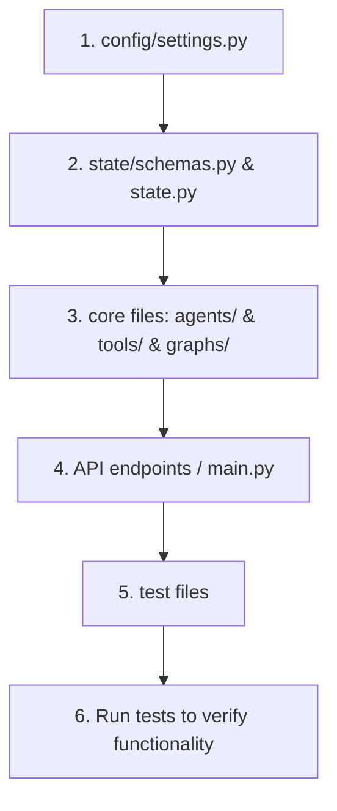

# Guidelines and Rules for Coding Agents

This project implements an AI Product Launch Team using LangGraph, Pydantic AI, and Groq. All development work by AI coding agents must adhere strictly to these guidelines.

---

## 1. Technology Stack

- **Runtime**: Python 3.12+
- **Package Manager**: `uv` (Use `uv add <package>` for adding dependencies)
- **LLM Provider**: Groq API (models like `llama-3.3-70b-versatile`)
- **Agent Framework**: `pydantic-ai`
- **Orchestration**: `langgraph`
- **Config & Validation**: `pydantic-settings` & `pydantic`
- **Environment Loader**: `python-dotenv`

---

## 2. Directory Structure Conventions

The project follows a modular structure. Keep components isolated and do not bypass the design layout:

- `config/` - Settings (Pydantic Settings) and logging setup.
- `state/` - Pydantic output schemas and LangGraph TypedDict states.
- `agents/` - Pydantic AI agent declarations (prompts, model definitions).
- `tools/` - Reusable functions exposed as tools to Pydantic AI agents.
- `graphs/` - LangGraph compilation and workflow node connections.
- `main.py` - Core entry point.

---

## 3. Implementation Standards & Flow

When implementing a new feature or modifying existing components, you must adhere to the following sequence:



1. **Config Setup**: Define any necessary environment variables or configurations in `config/settings.py` first.
2. **State & Schemas**: Define Pydantic models for inputs/outputs and update the LangGraph state.
3. **Core Files**: Declare agents, tools, or update LangGraph node functions.
4. **API Endpoints & Main Runner**: Integrate the logic into the execution entry points (`main.py`).
5. **Test Files**: Create unit tests for your changes.
6. **Execution Verification**: Always run tests using the python interpreter or pytest to confirm the implementation works correctly before reporting completion.

---

**Note**: If there's any file that should not be in version control (e.g. files holding sensitive credentials), add it to the .gitignore file.

## 4. Conventional Commits

All repository commits must follow the Conventional Commits specification.

### Format

```text
<type>(<scope>): <subject>

- <brief bullet point explaining change 1>
- <brief bullet point explaining change 2>

Authored by: <agent>@<model-type>
```

### Types

- `feat`: A new feature
- `fix`: A bug fix
- `docs`: Documentation changes
- `style`: Changes that do not affect the meaning of the code (formatting, white-space, etc.)
- `refactor`: A code change that neither fixes a bug nor adds a feature
- `perf`: A code change that improves performance
- `test`: Adding missing tests or correcting existing tests
- `build`: Changes that affect the build system or external dependencies
- `ci`: Changes to CI configuration files and scripts
- `chore`: Other changes that don't modify src or test files

### Example Commit Message

```text
feat(agents): add initial pm agent module

- Define PM agent using Pydantic AI configured with groq
- Set default llama-3.3-70b-versatile model
- Declare basic system prompt for Product Manager role

Authored by: Antigravity@gemini-3.5-flash
```
